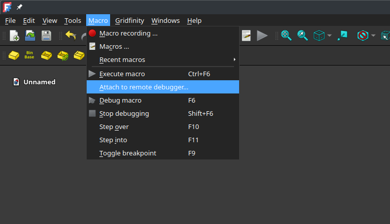
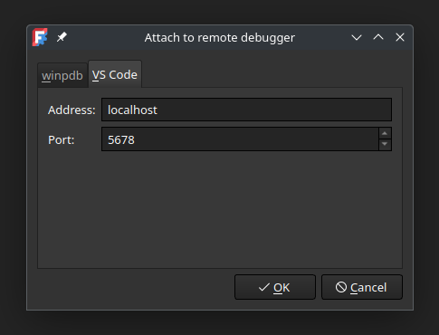
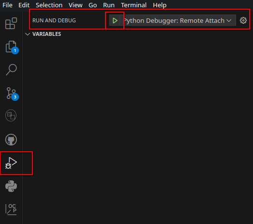
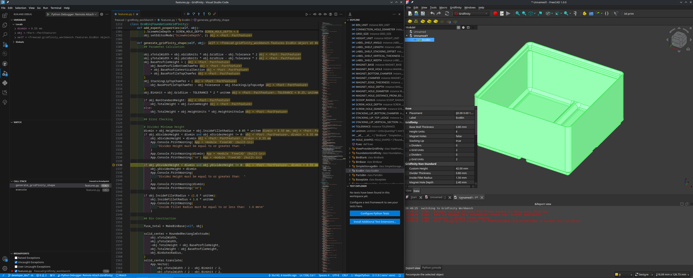

# Developing

This document describes some howtos and tips for developing this (and other) freecad workbench

## Autocomplete/Intelisense
FreeCAD exports its python API in its own directories as c/c++ libraries, there is no python package manager which deploys FreeCAD. This makes it diffecult for external IDEs to find the correct libraries and benefit from modern autocompletion. It could be added to the `PYTHON_PATH` variable which is far from ideal.
Luckely there is a python package available which provides FreeCAD python API stubs. This packages does nothing except providing the possible classes, datatypes and function calls. To make use of this in VsCode. Execute the following steps:

* install the follwoing vscode extention: `ms-python.python`
* press `ctrl` + `p` and execute Python: Create Enviroment
* pick your favorite python interpeter and install the dependecies from `requirments.txt`
* You are all setup to enjoy FreeCAD development with auto complete
* Keep in mind that the `freecad-stubs` module is not 100% correct.


## Debugging.
FreeCAD provides some support to debug workbenches and macros. We use VsCode in this example for debugging. We can attach our vscode debugger to FreeCAD:

* Clone the workbench somewhere where FreeCAD can find it:  
Windos: `TODO`  
Linux: `~/.local/share/FreeCAD/Mod/`  
MacOS: `TODO`  
* Open the workbench folder in VsCode. Make sure the following plugin is installed in VsCode: ms-python.debugpy.   
* Add the following json to your `.vscode/launch.json` file in the workspace:  
  ```json
  {
      "version": "0.2.0",
      "configurations": [
          {
              "name": "Python Debugger: Remote Attach",
              "type": "debugpy",
              "request": "attach",
              "connect": {
                  "host": "localhost",
                  "port": 5678
              },
              "justMyCode": false,
              "pathMappings": [
                  {
                      "localRoot": "${workspaceFolder}",
                      "remoteRoot": "/home/user/.local/share/FreeCAD/Mod/GridFinity/"
                  }
              ]
          }
      ]
  }
  ```  
* Open FreeCAD and start the debug server:  
    
    
  make sure the hostname/address and port are the same in the `launch.json` file and in FreeCAD  
* Attach to the server in vscode using the `launch.json`  
    
* You can set a breakpoint anywhere in the code, generate a model in FreeCAD which covers that code and debug.  
    
  
# Testing
This repository uses the python unittest framework for its regression testing. All regression test should and will be run in the CI/CD via github actions. Here are some steps to run the test manualy.

Both ways of working higly depend on the FreeCAD libraries installed on your system. Your global python interpeter should be able to find the `freecad` package and import this:


## OS global python interpeter
When the correct freecad import can be found, it is fairly easy to run the unittests:
```sh
python -m unittest discover tests -v
```
## Virtual enviroment
When using a virtual enviroment. The enviroment should be able to find the FreeCAD libraries. This is exactly what the global `freecad` module does. This module needs to be copied to the enviroment `site-packages` folder. To find the location of the `freecad` module, perform the following steps:
* open python interpeter
* import freecad
* freecad.__file__


The location in the screenshot above is `/usr/lib/python3.13/site-packages/freecad`. This folder needs to be copied to the virtual enviroment:
```sh
cp -r /usr/lib/python3.13/site-packages/freecad .venv/lib/python3.13/site-packages/
```

Now you can run the unittest using the unittest framework
```sh
python -m unittest discover tests -v
```

## Test output
The output of a test run shoul look something like this:

